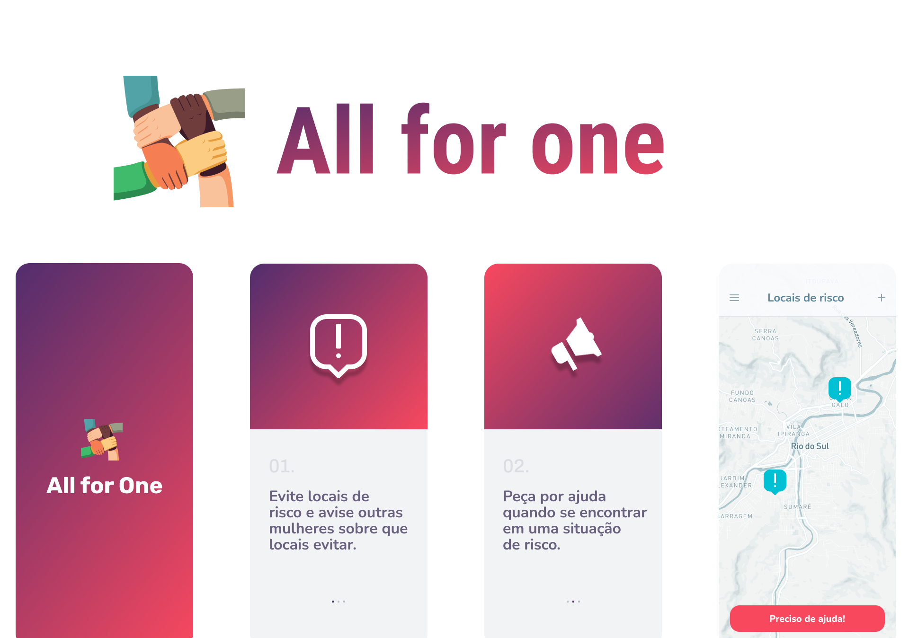

# All for One

All for One é um app de cunho social, que visa ajudar mulheres a evitar situações
de perigo.

## Telas e Funcionalidades

- SplashScreen
- Onboarding & Primeiros passos
  - Uma breve explicação sobre as funcionalidades do app
  - Possibilidade de usar o app com ou sem login
- Cadastro & Login
  - Cadastro de nome e número de celular
  - Aceite de Termos de uso
  - Login com código OTP (*One Time Password*)
  - Autenticação com JWT
- Mapa de Locais de Risco
  - Listagem de locais que podem oferecer algum risco em um mapa
  - Botão de pânico, para ligar para polícia
- Criação de local de risco no mapa
  - Seleção de ponto no mapa e cadastro de título e descrição
  - *Só é possível criar se estiver com um usuário logado
- Edição de local de risco
  - Edição dos dados de um local de risco
  - Exclusão de um local de risco
  - *Um usuário só pode editar um local de risco que tenha criado
- Forum
  - Web View para um fórum
- Perfil
  - Edição de informações do usuário
  - Logout
- Acolhimento
  - *Link externo para um site com o qual não temos ligação, mas que oferece 
  ajuda a mulheres. ([Mapa do acolhimento](https://www.queroseracolhida.mapadoacolhimento.org))
- Propagandas para ajudar a manter o app
  - Interstitial ad, propaganda de tela cheia que aparece em destaque no mapa e está sempre visível em tela, mesmo que o mapa seja movido
  - Banner ad, propaganda no canto inferior da tela

## Tecnologias

- Back-end:
  - Node.js
  - Nestjs
  - Jest
  - Mongodb
  - Docker
  - Typescript

- Front-end (Mobile app):
  - React native
  - Expo
  - Typescript

## Sobre

Projeto idealizado por um grupo de graduandos em administração e desenvolvido
por mim e outros graduandos de engenharia de computação na UNISAL no ano de 2022.

*Você pode ver vídeos do app funcionando e saber quem fez parte desse projeto 
nesse post no linkedIn.
